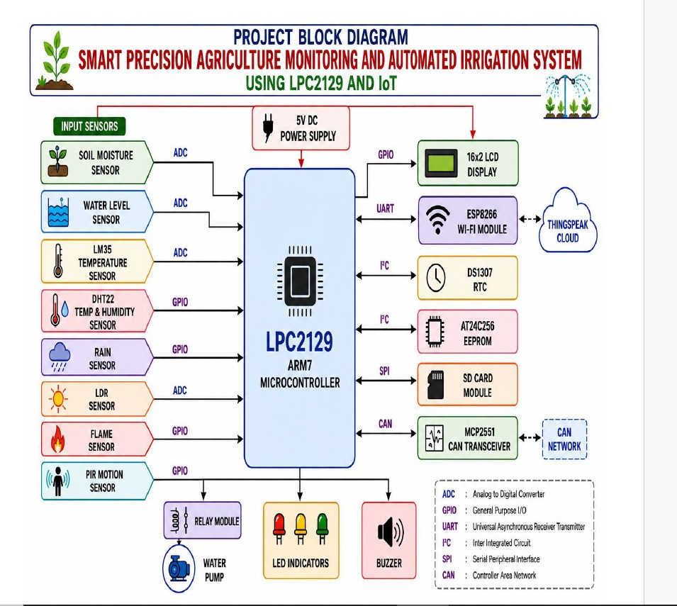

# 🌱 Smart Precision Agriculture Monitoring and Automated Irrigation System using LPC2129 and IoT

An 🌐 **IoT-enabled smart agriculture system** built using the **LPC2129 ARM7 Microcontroller** for real-time farm monitoring and automated irrigation. The system monitors 🌱 **soil moisture**, 💧 **water level**, 🌡️ **temperature**, 💦 **humidity**, 🌧️ **rainfall**, ☀️ **sunlight**, 🔥 **fire**, and 🚶 **motion**, and automatically controls the 💧 **water pump** based on field conditions.

Sensor data and system status are displayed on a **16×2 LCD**, stored using **AT24C256 EEPROM and SD Card**, timestamped using **DS1307 RTC**, and transmitted through 📶 **ESP8266 Wi-Fi** to ☁️ **ThingSpeak Cloud** for remote monitoring. The system also supports 🔗 **CAN communication using MCP2551** for future multi-controller agricultural applications.

---

# 🚀 Key Features

* 💧 Automatic Irrigation
* 🌱 Soil Moisture Monitoring
* 💦 Water Level Monitoring
* 🌡️ Temperature & Humidity Monitoring
* 🌧️ Rainfall Detection
* ☀️ Sunlight Monitoring
* 🔥 Fire Detection & Alerts
* 🚶 Motion Detection & Farm Security
* 📺 16×2 LCD Real-Time Display
* 📶 ESP8266 Wi-Fi Connectivity
* ☁️ ThingSpeak Cloud Monitoring
* 💾 EEPROM & SD Card Data Logging
* ⏱️ DS1307 RTC Event Tracking
* 🔗 MCP2551 CAN Communication
* 🔔 LED & Buzzer Alerts
* 🚰 Automatic Water Pump Control

---

# 🛠️ Technologies & Hardware Used

* **LPC2129 ARM7 Microcontroller**
* **ESP8266 Wi-Fi Module**
* **Soil Moisture Sensor**
* **Water Level Sensor**
* **LM35 Temperature Sensor**
* **DHT22 Temperature & Humidity Sensor**
* **Rain Sensor**
* **LDR Sensor**
* **Flame Sensor**
* **PIR Motion Sensor**
* **Relay Module & Water Pump**
* **16×2 LCD Display**
* **AT24C256 EEPROM**
* **SD Card Module**
* **DS1307 RTC**
* **MCP2551 CAN Transceiver**
* **ThingSpeak Cloud**

---

# 📡 Communication Interfaces

* **ADC** → Soil Moisture, Water Level, LM35, LDR
* **GPIO** → DHT22, Rain, Flame, PIR
* **UART** → LPC2129 ↔ ESP8266
* **I²C** → DS1307 RTC & AT24C256 EEPROM
* **SPI** → SD Card Module
* **CAN** → MCP2551 CAN Transceiver

---

# 🧠 System Working

1. 🌱 Sensors continuously collect agricultural and environmental data.
2. 🧠 LPC2129 processes the sensor readings.
3. 💧 Soil moisture is checked to determine irrigation requirements.
4. 🚰 If the soil is dry, sufficient water is available, and no rainfall is detected, the water pump is activated automatically.
5. 🌧️ Pump operation is stopped when sufficient moisture is reached or rainfall is detected.
6. 📺 Important system parameters are displayed on the 16×2 LCD.
7. 🔥 Fire and 🚶 motion detection generate safety alerts.
8. ⏱️ Important events are recorded with date and time using the DS1307 RTC.
9. 💾 Data is stored using EEPROM and SD Card.
10. 📶 ESP8266 sends system data to ☁️ ThingSpeak Cloud for remote monitoring.

---

# 📊 Monitored Parameters

| Parameter        | Sensor               | Interface |
| ---------------- | -------------------- | --------- |
| 🌱 Soil Moisture | Soil Moisture Sensor | ADC       |
| 💧 Water Level   | Water Level Sensor   | ADC       |
| 🌡️ Temperature  | LM35                 | ADC       |
| 💦 Humidity      | DHT22                | GPIO      |
| 🌧️ Rainfall     | Rain Sensor          | GPIO      |
| ☀️ Sunlight      | LDR                  | ADC       |
| 🔥 Fire          | Flame Sensor         | GPIO      |
| 🚶 Motion        | PIR Sensor           | GPIO      |

---

# 🎯 Project Objectives

* 💧 Reduce water wastage
* ⚡ Reduce unnecessary electricity consumption
* 🚜 Automate irrigation activities
* 🌱 Improve crop monitoring
* 📊 Maintain accurate agricultural data
* 🔥 Improve farm safety
* 📶 Enable remote IoT monitoring
* 🤖 Reduce continuous manual supervision
* 🔗 Support future multi-controller agricultural networks

---

# 🏗️ System Architecture

```text
                🌐 ThingSpeak Cloud
                       ▲
                       │ Wi-Fi
                       │
                 📶 ESP8266
                       │ UART
                       ▼
              🧠 LPC2129 ARM7
                       │
       ┌───────────────┼────────────────┐
       │               │                │
     🌱 Sensors      💾 Storage       ⚙️ Control
       │               │                │
   Soil Moisture    EEPROM/SD       Relay + Pump
   Water Level      DS1307 RTC      LCD / LEDs
   Temperature                       Buzzer
   Humidity
   Rainfall
   Sunlight
   Fire
   Motion
```

---

# 🔮 Future Scope

* 🤖 AI-based irrigation prediction
* 📱 Dedicated mobile application
* 🌦️ Weather API integration
* 📈 Advanced agricultural data analytics
* 🔗 Multi-field CAN-based monitoring
* ⚡ Solar-powered irrigation
* 🛰️ GPS-based farm monitoring

---
# 🏗️ Project Block Diagram

The block diagram below illustrates the complete architecture of the **Smart Precision Agriculture Monitoring and Automated Irrigation System**, including sensors, LPC2129 ARM7 controller, irrigation control, IoT connectivity, data storage, RTC, and CAN communication.



---

# 👨‍💻 Author

**Bhavya Rosiya**
